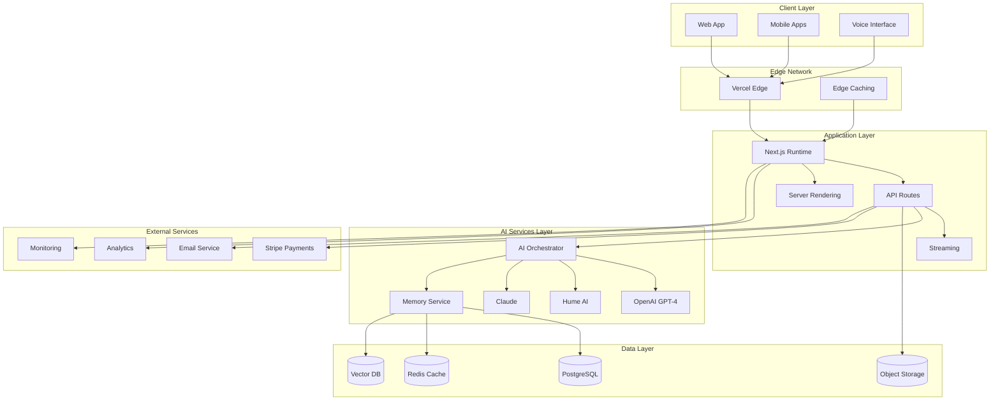

# Ki Platform Technical Architecture

**Version**: 1.0  
**Last Updated**: January 2025  
**Status**: Current  

## Overview

Ki is a relationship intelligence platform built on a modern, scalable architecture that combines conversational AI, emotional intelligence, and real-time communication to help couples transform conflicts into connection. The platform is designed with privacy-first principles, enterprise-grade security, and global scalability in mind.

## Architectural Principles

### 1. Privacy-First Design
- **Zero-Knowledge Architecture**: Minimize data exposure in cloud storage
- **End-to-End Encryption**: All sensitive communications encrypted
- **Individual Channels**: Separate encrypted channels per partner
- **Granular Consent**: User control over data sharing and usage

### 2. Emotional Intelligence
- **Multi-Modal Processing**: Text, voice, and contextual emotion analysis
- **Adaptive Responses**: AI personality adjusts to emotional states
- **Pattern Recognition**: Long-term relationship dynamic analysis
- **Crisis Detection**: Real-time safety monitoring and escalation

### 3. Scalable AI Architecture
- **Multi-Provider Support**: OpenAI, Anthropic, Hume AI integration
- **Intelligent Fallbacks**: Graceful degradation across AI services
- **Cost Optimization**: Smart caching and context management
- **Real-Time Processing**: Low-latency conversational experiences

### 4. Monorepo Excellence
- **Turborepo Foundation**: Efficient build and deployment pipelines
- **Shared Packages**: Consistent UI, utilities, and business logic
- **Type Safety**: End-to-end TypeScript with strict mode
- **Developer Experience**: Hot reloading, testing, and debugging tools

## System Architecture



## Application Architecture

### Frontend Architecture

```typescript
// Application structure
apps/
├── app/           # Main conversational interface
│   ├── components/    # Reusable UI components
│   ├── hooks/         # Custom React hooks
│   ├── lib/           # Utilities and configurations
│   └── app/           # Next.js App Router pages
├── web/           # Marketing and landing pages
├── docs/          # Documentation site
└── storybook/     # Component development and testing

// Shared packages
packages/
├── ui/            # shadcn/ui component library
├── auth/          # Authentication utilities
├── database/      # Prisma schema and utilities
├── analytics/     # Event tracking and metrics
└── ai/            # AI service integrations
```

### State Management Strategy

```typescript
// Global state with Zustand
interface AppState {
  // User authentication and profile
  user: User | null;
  subscription: Subscription | null;
  
  // Conversation state
  activeConversation: Conversation | null;
  conversations: Conversation[];
  
  // UI state
  theme: 'light' | 'dark';
  sidebarOpen: boolean;
  
  // AI state
  aiLoading: boolean;
  emotionalState: EmotionProfile | null;
}

// Local component state with useState/useReducer
// Form state with React Hook Form
// Server state with TanStack Query
```

### Component Architecture

```typescript
// Component hierarchy
<App>
  <AuthProvider>
    <ThemeProvider>
      <AnalyticsProvider>
        <Layout>
          <Sidebar />
          <MainContent>
            <ConversationInterface>
              <MessageList />
              <MessageInput />
              <VoiceInterface />
            </ConversationInterface>
            <InsightsPanel />
          </MainContent>
        </Layout>
      </AnalyticsProvider>
    </ThemeProvider>
  </AuthProvider>
</App>
```

## Backend Architecture

### API Design

```typescript
// RESTful API structure
/api/
├── auth/              # Authentication endpoints
├── users/             # User management
├── conversations/     # Conversation CRUD
├── messages/          # Message handling
├── insights/          # Pattern analysis
├── emotions/          # Emotion processing
├── subscriptions/     # Billing management
└── webhooks/          # External service hooks

// Real-time endpoints
/api/stream/
├── conversations/     # Server-sent events
├── voice/            # WebRTC signaling
└── presence/         # User presence updates
```

### Middleware Stack

```typescript
// Request processing pipeline
Request → Authentication → Rate Limiting → Validation → Business Logic → Response

// Middleware components
- CORS handling
- Request logging
- Error handling
- Security headers
- Compression
- Cache control
```

### Database Architecture

#### Schema Design

```sql
-- Core user and relationship data
CREATE TABLE users (
  id UUID PRIMARY KEY DEFAULT gen_random_uuid(),
  email VARCHAR(255) UNIQUE NOT NULL,
  name VARCHAR(100),
  partner_name VARCHAR(100),
  relationship_status VARCHAR(50),
  subscription_tier VARCHAR(20) DEFAULT 'free',
  privacy_settings JSONB DEFAULT '{}',
  created_at TIMESTAMP WITH TIME ZONE DEFAULT NOW(),
  updated_at TIMESTAMP WITH TIME ZONE DEFAULT NOW()
);

-- Conversation and message storage
CREATE TABLE conversations (
  id UUID PRIMARY KEY DEFAULT gen_random_uuid(),
  user_id UUID REFERENCES users(id) ON DELETE CASCADE,
  title VARCHAR(200),
  status VARCHAR(20) DEFAULT 'active',
  participants JSONB DEFAULT '[]',
  metadata JSONB DEFAULT '{}',
  created_at TIMESTAMP WITH TIME ZONE DEFAULT NOW(),
  updated_at TIMESTAMP WITH TIME ZONE DEFAULT NOW()
);

CREATE TABLE messages (
  id UUID PRIMARY KEY DEFAULT gen_random_uuid(),
  conversation_id UUID REFERENCES conversations(id) ON DELETE CASCADE,
  role VARCHAR(20) NOT NULL, -- 'user', 'assistant', 'system'
  content TEXT NOT NULL,
  emotions JSONB,
  metadata JSONB DEFAULT '{}',
  created_at TIMESTAMP WITH TIME ZONE DEFAULT NOW()
);

-- AI insights and patterns
CREATE TABLE relationship_patterns (
  id UUID PRIMARY KEY DEFAULT gen_random_uuid(),
  user_id UUID REFERENCES users(id) ON DELETE CASCADE,
  pattern_type VARCHAR(50) NOT NULL,
  category VARCHAR(50) NOT NULL,
  frequency INTEGER DEFAULT 1,
  intensity DECIMAL(3,2),
  trend VARCHAR(20), -- 'improving', 'stable', 'declining'
  first_occurrence TIMESTAMP WITH TIME ZONE,
  last_occurrence TIMESTAMP WITH TIME ZONE,
  triggers TEXT[],
  insights TEXT[],
  created_at TIMESTAMP WITH TIME ZONE DEFAULT NOW()
);

-- Vector embeddings for semantic search
CREATE TABLE conversation_embeddings (
  id UUID PRIMARY KEY DEFAULT gen_random_uuid(),
  conversation_id UUID REFERENCES conversations(id) ON DELETE CASCADE,
  user_id UUID REFERENCES users(id) ON DELETE CASCADE,
  content_summary TEXT,
  embedding VECTOR(1536), -- OpenAI embedding dimension
  relevance_score DECIMAL(4,3),
  created_at TIMESTAMP WITH TIME ZONE DEFAULT NOW()
);

-- User memory and context
CREATE TABLE user_memory (
  id UUID PRIMARY KEY DEFAULT gen_random_uuid(),
  user_id UUID REFERENCES users(id) ON DELETE CASCADE,
  memory_type VARCHAR(50), -- 'preference', 'pattern', 'milestone'
  content TEXT NOT NULL,
  importance_score DECIMAL(3,2),
  last_accessed TIMESTAMP WITH TIME ZONE DEFAULT NOW(),
  created_at TIMESTAMP WITH TIME ZONE DEFAULT NOW()
);
```

#### Indexes and Performance

```sql
-- Performance indexes
CREATE INDEX idx_conversations_user_id ON conversations(user_id);
CREATE INDEX idx_messages_conversation_id ON messages(conversation_id);
CREATE INDEX idx_messages_created_at ON messages(created_at DESC);
CREATE INDEX idx_patterns_user_id_type ON relationship_patterns(user_id, pattern_type);
CREATE INDEX idx_embeddings_user_id ON conversation_embeddings(user_id);

-- Full-text search
CREATE INDEX idx_messages_content_fts ON messages USING gin(to_tsvector('english', content));
CREATE INDEX idx_memory_content_fts ON user_memory USING gin(to_tsvector('english', content));

-- Vector similarity search (using pgvector)
CREATE INDEX idx_embeddings_vector ON conversation_embeddings USING ivfflat (embedding vector_cosine_ops);
```

## AI Service Architecture

### AI Orchestration Layer

```typescript
interface AIOrchestrator {
  // Core conversation processing
  processMessage(input: MessageInput): Promise<AIResponse>;
  
  // Multi-modal emotion analysis
  analyzeEmotions(text: string, audio?: AudioBuffer): Promise<EmotionProfile>;
  
  // Memory and context management
  retrieveContext(userId: string, query: string): Promise<ConversationContext>;
  
  // Pattern recognition and insights
  generateInsights(conversations: Conversation[]): Promise<Insight[]>;
  
  // Crisis detection and escalation
  detectCrisis(message: string, emotions: EmotionProfile): Promise<CrisisAssessment>;
}
```

### Provider Integration Strategy

```typescript
// AI service configuration
const aiConfig = {
  providers: {
    conversation: {
      primary: 'openai-gpt4',
      fallback: 'openai-gpt35',
      emergency: 'anthropic-claude'
    },
    emotion: {
      text: 'openai-sentiment',
      voice: 'hume-octave'
    },
    embeddings: 'openai-text-embedding-3-small'
  },
  
  fallbackStrategy: 'cascade', // Try providers in order
  retryPolicy: {
    maxRetries: 3,
    backoffMultiplier: 2,
    initialDelay: 1000
  },
  
  costOptimization: {
    cacheResponses: true,
    contextCompression: true,
    intelligentRouting: true
  }
};
```

### Memory Management System

```typescript
// Hierarchical memory architecture
interface MemorySystem {
  // Short-term conversational context
  shortTerm: {
    activeSession: ConversationMemory;
    recentMessages: Message[];
    currentEmotionalState: EmotionProfile;
  };
  
  // Medium-term episodic memory
  episodic: {
    recentConversations: ConversationSummary[];
    weeklyPatterns: PatternSummary[];
    emotionalTrends: EmotionTrend[];
  };
  
  // Long-term semantic memory
  semantic: {
    relationshipPatterns: RelationshipPattern[];
    userPreferences: UserPreference[];
    growthMilestones: Milestone[];
  };
  
  // Persistent user profile
  profile: {
    personalityTraits: PersonalityProfile;
    communicationStyle: CommunicationPreference;
    relationshipGoals: Goal[];
  };
}
```

## Security Architecture

### Authentication & Authorization

```typescript
// JWT-based authentication with refresh tokens
interface AuthSystem {
  // Authentication methods
  signIn(credentials: LoginCredentials): Promise<AuthTokens>;
  signUp(userData: RegistrationData): Promise<User>;
  refreshToken(token: RefreshToken): Promise<AuthTokens>;
  
  // Authorization checks
  authorize(user: User, resource: Resource, action: Action): boolean;
  
  // Session management
  createSession(user: User): Promise<Session>;
  validateSession(token: AccessToken): Promise<Session>;
  revokeSession(sessionId: string): Promise<void>;
}

// Role-based access control
enum Role {
  USER = 'user',
  PREMIUM = 'premium',
  ADMIN = 'admin'
}

enum Permission {
  READ_CONVERSATIONS = 'read:conversations',
  WRITE_CONVERSATIONS = 'write:conversations',
  READ_INSIGHTS = 'read:insights',
  ADMIN_USERS = 'admin:users'
}
```

### Data Encryption

```typescript
// Multi-layer encryption strategy
interface EncryptionService {
  // User data encryption
  encryptUserData(data: any, userId: string): Promise<EncryptedData>;
  decryptUserData(encrypted: EncryptedData, userId: string): Promise<any>;
  
  // Conversation encryption
  encryptConversation(conversation: Conversation): Promise<EncryptedConversation>;
  decryptConversation(encrypted: EncryptedConversation): Promise<Conversation>;
  
  // Key management
  generateUserKey(userId: string): Promise<CryptoKey>;
  rotateKeys(userId: string): Promise<void>;
}

// Encryption layers
- Transport: TLS 1.3
- Application: AES-256-GCM with user-specific keys
- Database: Transparent Data Encryption (TDE)
- Backups: Encrypted at rest with separate key management
```

### Privacy Controls

```typescript
// Granular privacy settings
interface PrivacySettings {
  dataSharing: {
    allowAnalytics: boolean;
    allowImprovements: boolean;
    allowPartnerInsights: boolean;
  };
  
  dataRetention: {
    conversationHistory: RetentionPeriod;
    voiceRecordings: RetentionPeriod;
    emotionalData: RetentionPeriod;
  };
  
  access: {
    partnerAccess: AccessLevel;
    emergencyAccess: boolean;
    dataExport: boolean;
  };
}
```

## Performance Architecture

### Caching Strategy

```typescript
// Multi-tier caching
interface CacheStrategy {
  // Edge caching (Vercel Edge)
  edge: {
    staticAssets: CacheConfig;
    apiResponses: CacheConfig;
    userProfiles: CacheConfig;
  };
  
  // Application caching (Redis)
  application: {
    sessions: CacheConfig;
    conversations: CacheConfig;
    aiResponses: CacheConfig;
  };
  
  // Database caching
  database: {
    queryCache: CacheConfig;
    connectionPool: PoolConfig;
  };
}
```

### Optimization Strategies

```typescript
// Performance optimization
interface PerformanceOptimization {
  // Frontend optimizations
  frontend: {
    codesplitting: boolean;
    lazyLoading: boolean;
    imageOptimization: boolean;
    bundleAnalysis: boolean;
  };
  
  // Backend optimizations
  backend: {
    apiResponseCompression: boolean;
    databaseIndexing: boolean;
    connectionPooling: boolean;
    queryOptimization: boolean;
  };
  
  // AI optimizations
  ai: {
    responseStreaming: boolean;
    contextOptimization: boolean;
    modelRouting: boolean;
    cachingIntelligent: boolean;
  };
}
```

## Monitoring & Observability

### Application Monitoring

```typescript
// Comprehensive monitoring stack
interface MonitoringSystem {
  // Performance monitoring
  performance: {
    responseTime: Metric;
    throughput: Metric;
    errorRate: Metric;
    availability: Metric;
  };
  
  // Business metrics
  business: {
    userEngagement: Metric;
    conversationQuality: Metric;
    retentionRate: Metric;
    conversionRate: Metric;
  };
  
  // AI quality metrics
  aiQuality: {
    responseRelevance: Metric;
    emotionAccuracy: Metric;
    patternDetection: Metric;
    crisisDetection: Metric;
  };
}
```

### Error Handling & Alerting

```typescript
// Error management system
interface ErrorHandling {
  // Error classification
  classify(error: Error): ErrorCategory;
  
  // Error recovery
  recover(error: Error, context: Context): Promise<RecoveryResult>;
  
  // Alerting
  alert(error: Error, severity: Severity): Promise<void>;
  
  // Logging
  log(event: Event, metadata: Metadata): Promise<void>;
}
```

## Deployment Architecture

### Infrastructure as Code

```typescript
// Vercel deployment configuration
const deploymentConfig = {
  projects: {
    app: {
      framework: 'nextjs',
      buildCommand: 'pnpm build',
      outputDirectory: '.next',
      nodeVersion: '18.x'
    },
    web: {
      framework: 'nextjs',
      buildCommand: 'pnpm build',
      outputDirectory: '.next',
      nodeVersion: '18.x'
    }
  },
  
  environment: {
    production: {
      domains: ['app.ki.com', 'ki.com'],
      regions: ['iad1', 'sfo1', 'lhr1'],
      scaling: 'auto'
    }
  }
};
```

### CI/CD Pipeline

```yaml
# GitHub Actions workflow
name: Deploy Ki Platform
on:
  push:
    branches: [main]
  pull_request:
    branches: [main]

jobs:
  test:
    runs-on: ubuntu-latest
    steps:
      - uses: actions/checkout@v3
      - uses: pnpm/action-setup@v2
      - run: pnpm install
      - run: pnpm lint
      - run: pnpm type-check
      - run: pnpm test
      - run: pnpm build

  deploy:
    needs: test
    runs-on: ubuntu-latest
    if: github.ref == 'refs/heads/main'
    steps:
      - uses: actions/checkout@v3
      - uses: amondnet/vercel-action@v20
        with:
          vercel-token: ${{ secrets.VERCEL_TOKEN }}
          vercel-org-id: ${{ secrets.ORG_ID }}
          vercel-project-id: ${{ secrets.PROJECT_ID }}
```

## Scalability Considerations

### Horizontal Scaling

```typescript
// Auto-scaling configuration
interface ScalingStrategy {
  // Application scaling
  application: {
    minInstances: number;
    maxInstances: number;
    targetUtilization: number;
    scaleUpPolicy: ScalingPolicy;
    scaleDownPolicy: ScalingPolicy;
  };
  
  // Database scaling
  database: {
    readReplicas: number;
    connectionPoolSize: number;
    shardingStrategy: ShardingConfig;
  };
  
  // AI service scaling
  ai: {
    requestQueueing: boolean;
    loadBalancing: LoadBalancingStrategy;
    fallbackRouting: FallbackConfig;
  };
}
```

### Performance Targets

```typescript
// Service Level Objectives (SLOs)
const performanceTargets = {
  // User experience
  pageLoadTime: '< 2 seconds',
  apiResponseTime: '< 200ms (p95)',
  aiResponseTime: '< 3 seconds',
  
  // Availability
  uptime: '99.9%',
  errorRate: '< 0.1%',
  
  // Scalability
  concurrentUsers: '10,000+',
  dailyConversations: '100,000+',
  monthlyMessages: '10,000,000+'
};
```

This technical architecture provides a comprehensive foundation for building, scaling, and maintaining the Ki platform while ensuring security, performance, and user experience excellence.