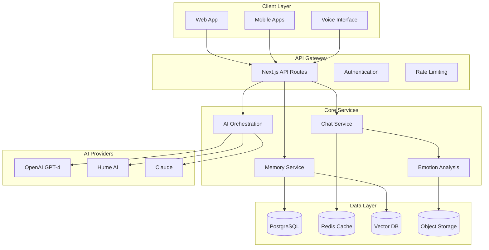

# Ki Platform System Architecture

## High-Level Architecture



## Core Components

### 1. Next.js Frontend Applications
- **Web App** (`apps/app`): Main conversational interface
- **Marketing Site** (`apps/web`): Public website and landing pages
- **Documentation** (`apps/docs`): Platform documentation

### 2. API Layer
- **Chat API**: Real-time conversation handling
- **User API**: Profile and relationship management
- **Memory API**: Conversation history and insights
- **Webhook API**: External service integrations

### 3. AI Orchestration
```typescript
// Central AI service coordination
interface AIOrchestrator {
  processMessage(input: MessageInput): Promise<AIResponse>;
  detectEmotion(audio: AudioBuffer): Promise<EmotionProfile>;
  generateInsights(history: Conversation[]): Promise<Insight[]>;
  manageFallbacks(error: AIError): Promise<FallbackResponse>;
}
```

### 4. Memory System
- **Short-term**: Redis for session state
- **Long-term**: PostgreSQL for structured data
- **Semantic**: Vector database for similarity search
- **Media**: S3 for audio/voice recordings

## Data Flow

### 1. Conversation Processing
```
User Input → Emotion Detection → Memory Retrieval → AI Processing → Response Generation → Memory Storage
```

### 2. Dual-Partner Flow
```
Partner A Input ─┐
                 ├─→ Shared Context Analysis → Dual Response Generation
Partner B Input ─┘
```

### 3. Memory Consolidation
```
Conversation End → Pattern Analysis → Insight Generation → Memory Update → User Notification
```

## Security Architecture

### 1. Encryption Layers
- **Transport**: TLS 1.3 for all communications
- **Application**: End-to-end encryption for conversations
- **Storage**: AES-256 encryption at rest

### 2. Privacy Controls
- **Individual Channels**: Separate encrypted channels per partner
- **Shared Spaces**: Encrypted shared relationship data
- **Selective Sharing**: Granular control over data sharing

### 3. Authentication Flow
```typescript
// Multi-factor authentication with JWT tokens
interface AuthFlow {
  login(credentials: LoginCredentials): Promise<AuthTokens>;
  refresh(token: RefreshToken): Promise<AuthTokens>;
  validateSession(token: AccessToken): Promise<UserSession>;
  revokeAccess(userId: string): Promise<void>;
}
```

## Scalability Patterns

### 1. Horizontal Scaling
- **Stateless Services**: All API endpoints are stateless
- **Load Balancing**: Automatic traffic distribution
- **Auto-scaling**: Based on conversation volume

### 2. Database Optimization
- **Read Replicas**: For conversation history queries
- **Sharding**: User data partitioned by geography
- **Caching**: Multi-layer caching strategy

### 3. AI Service Management
- **Circuit Breakers**: Prevent cascade failures
- **Fallback Chains**: Multiple AI provider fallbacks
- **Rate Limiting**: Intelligent API usage management

## Monitoring & Observability

### 1. Application Monitoring
- **Performance**: Response times and throughput
- **Errors**: AI service failures and recovery
- **Usage**: Conversation patterns and engagement

### 2. AI Quality Metrics
- **Response Quality**: User satisfaction ratings
- **Emotional Accuracy**: Emotion detection precision
- **Pattern Recognition**: Insight relevance scores

### 3. Business Metrics
- **User Engagement**: Daily/monthly active users
- **Retention**: Conversation completion rates
- **Health**: Crisis detection effectiveness

## Infrastructure

### 1. Production Environment
- **Platform**: Vercel for Next.js applications
- **Database**: Neon PostgreSQL with read replicas
- **Cache**: Upstash Redis for session management
- **Storage**: Vercel Blob for media files

### 2. Development Environment
- **Local**: Docker Compose for full stack
- **Testing**: Vitest for unit/integration tests
- **Staging**: Preview deployments for each PR

### 3. CI/CD Pipeline
- **Build**: Turborepo for monorepo builds
- **Test**: Automated testing on all PRs
- **Deploy**: Automatic deployment to Vercel
- **Monitor**: Real-time performance tracking